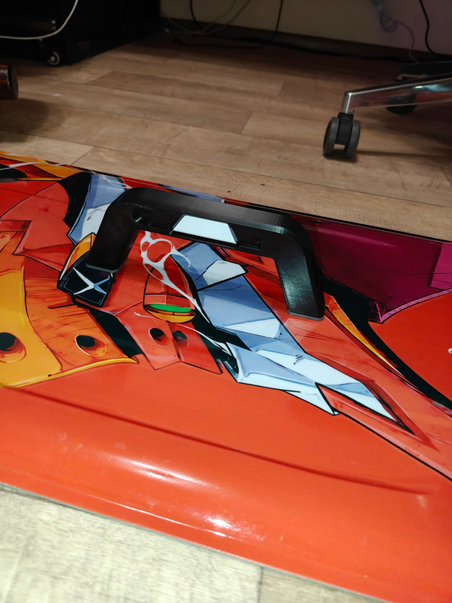
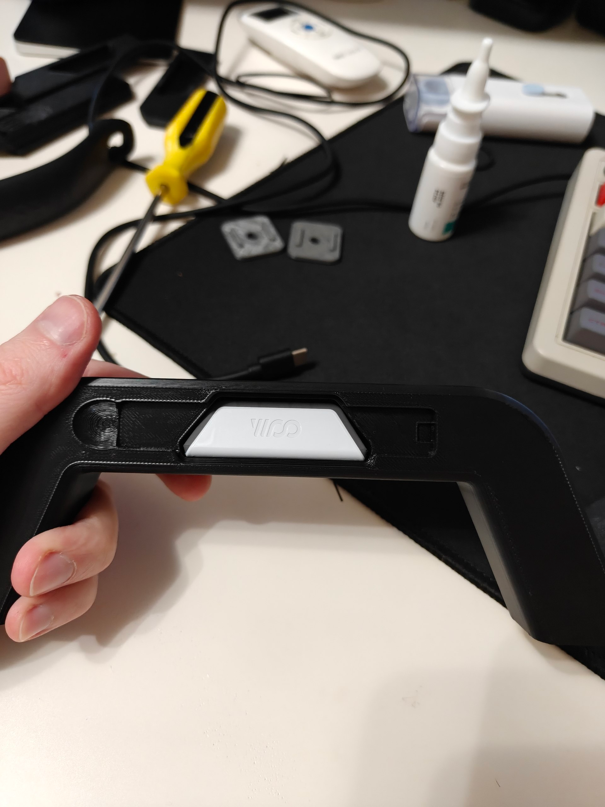
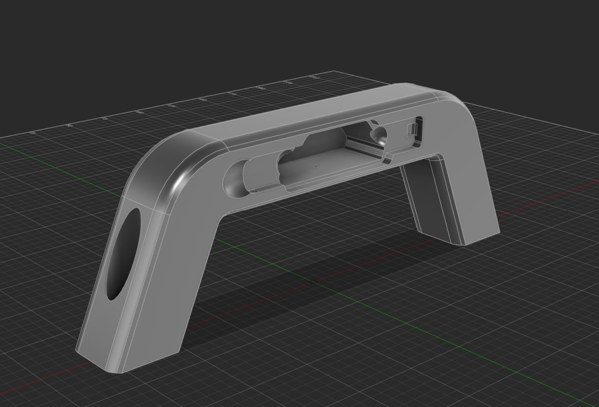
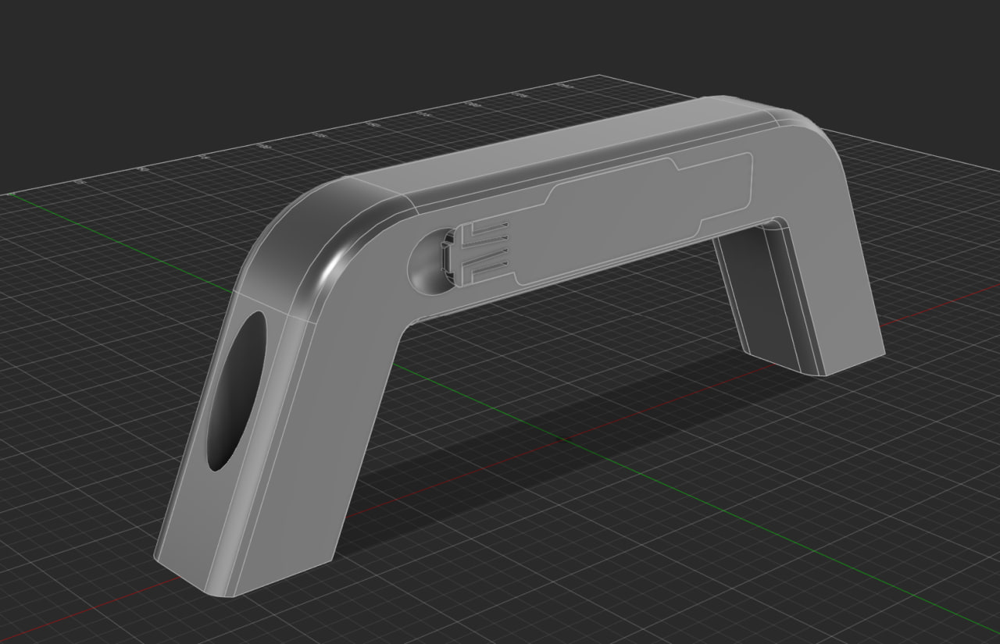

# KiteboardHandleForWOO4 — Kiteboard Handle for WOO 4

A kiteboard handle with an integrated WOO 4 sensor cavity, a removable flush cover, and optional TPU foot pads. A Python script generates the model in Fusion 360 and exports the parts for 3D printing.

## Photos and model views

### Printed handle

| Mounted on a kiteboard | WOO 4 sensor in the cavity, cover removed |
| --- | --- |
|  |  |

### 3D model

| Cover removed | Cover installed |
| --- | --- |
|  |  |

## Features

- Integrated WOO 4 cavity with finger recesses for removing the sensor.
- Flush cover with a rigid tongue on one side and two mirrored snap catches on the other.
- Rounded pull lip and finger scoop for opening the cover.
- Optional drain hole through the grip.
- Optional TPU foot pads with locating keys and matching pockets in the handle.
- Configurable dimensions, clearances, fastening geometry, and export options.

The default configuration uses **180 mm bolt spacing**, **M6 mounting holes**, a **72 mm handle height above the board reference plane**, and **3 mm TPU pads**. With the pads enabled, the total assembly height is 75 mm.

## Files

The script, manifest, STL files, and Fusion archive are in the repository root. Photos are in `images/`.

```text
KiteboardHandleForWOO4/
├── README.md
├── KiteboardHandleForWOO4.py
├── KiteboardHandleForWOO4.manifest
├── Handle.stl
├── Cover.stl
├── TPU_Pad_Left.stl
├── TPU_Pad_Right.stl
├── KiteHandle_WOO.f3d
├── build_report.json
└── images/
```

| File | Purpose |
| --- | --- |
| `KiteboardHandleForWOO4.py` | Model generator and editable settings |
| `KiteboardHandleForWOO4.manifest` | Script metadata used by Fusion |
| `Handle.stl` | Printable handle |
| `Cover.stl` | Printable cover |
| `TPU_Pad_Left.stl`, `TPU_Pad_Right.stl` | Printable foot pads |
| `KiteHandle_WOO.f3d` | Complete Fusion model archive |
| `build_report.json` | Build status, settings, dimensions, and geometry checks |

You can use the supplied STL files as a starting point, or run the script to generate your own configuration.

## Install in Fusion 360

You need Autodesk Fusion on Windows or macOS. The script uses Fusion's built-in Python environment; no separate Python installation or pip packages are required.

1. Download this repository using **Code → Download ZIP** and extract it, or clone it with Git.
2. Copy `KiteboardHandleForWOO4.py` and `KiteboardHandleForWOO4.manifest` from the repository root into a separate folder named `KiteboardHandleForWOO4` for installation in Fusion:

   ```text
   KiteboardHandleForWOO4/
   ├── KiteboardHandleForWOO4.py
   └── KiteboardHandleForWOO4.manifest
   ```

3. Put this installation folder somewhere writable. Generated files are saved beside the installed script. When changing settings, edit this copy of `KiteboardHandleForWOO4.py`.
4. Open Fusion and go to **Utilities → Add-Ins → Scripts and Add-Ins**.
5. On the **Scripts** tab, click **+** to add a local script and select the `KiteboardHandleForWOO4` folder.
6. Select **KiteboardHandleForWOO4** in the script list and click **Run**.

See Autodesk's [Scripts and Add-Ins instructions](https://help.autodesk.com/cloudhelp/ENU/Fusion-Model/files/SLD-MANAGE-SCRIPTS-ADD-INS.htm) for the official workflow.

## What happens when you run it

The script creates a **new document in Direct Design mode**, builds the handle and cover, adds the enabled features, and checks the resulting geometry. A message appears when the build finishes.

With `exportFiles = True`, it saves the F3D archive and separate STL files beside the script. TPU STL files are exported when `enableFootPads = True`. The script also writes `build_report.json`.

**Running again overwrites exports with the same names.** Copy any configuration you want to keep to another folder before rebuilding. Files from previously enabled options may remain in the folder after those options are disabled.

## Change the settings

> **Adjust `fitGap` and `snapClearance` for your printer. I used `fitGap = 0.1` and `snapClearance = 0.2` on a Creality K2.**

Open `KiteboardHandleForWOO4.py` in a text editor and edit the **SETTINGS / НАСТРОЙКИ** section near the top. Save the file, then run it again in Fusion.

All setting lengths are in **millimeters**; `lidTiltAngle` is in **degrees**. Dimensions are controlled by the Python settings: each run rebuilds the model in a new document.

| Setting | What it changes |
| --- | --- |
| `boltSpacing` | Distance between mounting bolt centers |
| `handleTop` | Handle height above the board reference plane |
| `gripH`, `gripD` | Grip cross-section dimensions |
| `legLean`, `bendR` | Leg inclination and upper bend geometry |
| `fitGap`, `lidGap`, `snapClearance` | Fit and fastening clearances; read each comment for how it is applied |
| `wooProfileOffset`, `wooFitClearance` | WOO cavity outline allowance |
| `enableFootPads`, `padThickness` | TPU pads and their base thickness |
| `enableWooFingerRecesses` | Sensor removal recesses |
| `enableDrainHole` | Drain hole |
| `makeFitSample` | Additional fastener sample components for a test print |
| `exportFiles`, `showMessage` | Automatic exports and the completion dialog |

For example, change `boltSpacing` to match the measured mounting distance on your board. Some settings are calculated from other settings; keep those expressions unless you intend to change their relationship.

Not every combination of dimensions is geometrically possible. If a build fails, check the error dialog and the `stage` and `error` fields in `build_report.json`, then adjust the relevant settings. Fit sample components, when enabled, can be exported manually from Fusion.

## Customize with ChatGPT

For simple changes, edit the settings directly. For a different handle shape or a new feature, attach **`KiteboardHandleForWOO4.py`** to ChatGPT and describe what you want to change. I prefer **ChatGPT Astra**. In my experience, it works best with 3D.

Include your target dimensions, a sketch or reference image if useful.

Save the returned script as `KiteboardHandleForWOO4.py`, keep the manifest beside it, and run it in Fusion. Review the generated geometry and try the fit before using the modified parts.

## TPU foot pads

The TPU pads are intended to compensate for the handle's stiffness. In theory, an overly rigid handle could change how the board flexes. The idea is that the pads compress as the board bends, reducing the restriction imposed by the handle.

The pads also help protect the board from scratches, since TPU is softer than the rigid plastic used for the handle.

They are optional: you can skip printing them. Everyone I know who rides with a printed handle uses it without pads.

## Printing

I printed the handle on a **Creality K2** using **ASA** filament with the following settings:

| Setting | Value |
| --- | --- |
| Walls | 5 |
| Alternate extra wall | Enabled (`true`) |
| Infill density | 25% |
| Infill pattern | Gyroid |

---

<!-- Русская версия -->

# KiteboardHandleForWOO4 — ручка для кайтборда с креплением WOO 4

Настраиваемая ручка для кайтборда со встроенной полостью для датчика WOO 4, съёмной крышкой и опциональными TPU-проставками под ножки. Python-скрипт строит модель в Fusion 360 и экспортирует детали для 3D-печати.

## Фотографии и виды модели

### Напечатанная ручка

| Установлена на кайтборде | Датчик WOO 4 в полости, крышка снята |
| --- | --- |
|  |  |

### 3D-модель

| Крышка снята | Крышка установлена |
| --- | --- |
|  |  |

## Возможности

- Встроенная полость для WOO 4 с выемками для извлечения датчика пальцами.
- Крышка с жёстким язычком с одной стороны и двумя зеркальными защёлками с другой.
- Скруглённая полочка и ложбинка для открывания крышки пальцем.
- Опциональное сливное отверстие через хват.
- Опциональные TPU-проставки с установочными выступами и ответными пазами в ручке.
- Настраиваемые размеры, зазоры, геометрия креплений и параметры экспорта.

По умолчанию заданы **межцентровое расстояние болтов 180 мм**, **монтажные отверстия под M6**, **высота ручки 72 мм над опорной плоскостью доски** и **TPU-проставки толщиной 3 мм**. С проставками общая высота сборки составляет 75 мм.

## Файлы

Скрипт, манифест, STL-файлы и архив Fusion находятся в корне репозитория. Фотографии — в папке `images/`.

```text
KiteboardHandleForWOO4/
├── README.md
├── KiteboardHandleForWOO4.py
├── KiteboardHandleForWOO4.manifest
├── Handle.stl
├── Cover.stl
├── TPU_Pad_Left.stl
├── TPU_Pad_Right.stl
├── KiteHandle_WOO.f3d
├── build_report.json
└── images/
```

| Файл | Назначение |
| --- | --- |
| `KiteboardHandleForWOO4.py` | Генератор модели и редактируемые настройки |
| `KiteboardHandleForWOO4.manifest` | Метаданные скрипта для Fusion |
| `Handle.stl` | Ручка для печати |
| `Cover.stl` | Крышка для печати |
| `TPU_Pad_Left.stl`, `TPU_Pad_Right.stl` | Проставки под ножки для печати |
| `KiteHandle_WOO.f3d` | Полный архив модели Fusion |
| `build_report.json` | Статус построения, настройки, размеры и проверки геометрии |

Можно использовать готовые STL-файлы как отправную точку или запустить скрипт, чтобы создать собственную конфигурацию.

## Установка во Fusion 360

Понадобится Autodesk Fusion на Windows или macOS. Скрипт использует встроенную среду Python в Fusion; отдельно устанавливать Python или пакеты через pip не нужно.

1. Скачайте репозиторий через **Code → Download ZIP** и распакуйте его либо клонируйте с помощью Git.
2. Скопируйте `KiteboardHandleForWOO4.py` и `KiteboardHandleForWOO4.manifest` из корня репозитория в отдельную папку `KiteboardHandleForWOO4` для установки во Fusion:

   ```text
   KiteboardHandleForWOO4/
   ├── KiteboardHandleForWOO4.py
   └── KiteboardHandleForWOO4.manifest
   ```

3. Разместите папку установки там, где разрешена запись. Созданные файлы сохраняются рядом с установленным скриптом. При изменении настроек редактируйте эту копию `KiteboardHandleForWOO4.py`.
4. Откройте Fusion и перейдите в **Utilities → Add-Ins → Scripts and Add-Ins**.
5. На вкладке **Scripts** нажмите **+**, чтобы добавить локальный скрипт, и выберите папку `KiteboardHandleForWOO4`.
6. Выберите **KiteboardHandleForWOO4** в списке скриптов и нажмите **Run**.

Официальный порядок действий описан в [инструкции Autodesk по Scripts and Add-Ins](https://help.autodesk.com/cloudhelp/ENU/Fusion-Model/files/SLD-MANAGE-SCRIPTS-ADD-INS.htm).

## Что происходит при запуске

Скрипт создаёт **новый документ в режиме Direct Design**, строит ручку и крышку, добавляет включённые элементы и проверяет полученную геометрию. По завершении появляется сообщение.

При `exportFiles = True` архив F3D и отдельные STL сохраняются рядом со скриптом. STL проставок экспортируются при `enableFootPads = True`. Скрипт также записывает `build_report.json`.

**Повторный запуск перезаписывает экспортированные файлы с теми же именами.** Перед перестроением скопируйте нужную конфигурацию в другую папку. Файлы от ранее включённых опций могут остаться в папке после их отключения.

## Изменение настроек

> **Отрегулируйте `fitGap` и `snapClearance` под свой принтер. Я использовал `fitGap = 0.1` и `snapClearance = 0.2` на Creality K2.**

Откройте `KiteboardHandleForWOO4.py` в текстовом редакторе и измените раздел **SETTINGS / НАСТРОЙКИ** в начале файла. Сохраните файл и снова запустите скрипт во Fusion.

Все длины в настройках указаны в **миллиметрах**, а `lidTiltAngle` — в **градусах**. Размеры задаются настройками Python: при каждом запуске модель строится заново в новом документе.

| Настройка | Что меняет |
| --- | --- |
| `boltSpacing` | Межцентровое расстояние монтажных болтов |
| `handleTop` | Высоту ручки над опорной плоскостью доски |
| `gripH`, `gripD` | Размеры поперечного сечения хвата |
| `legLean`, `bendR` | Наклон ножек и геометрию верхних изгибов |
| `fitGap`, `lidGap`, `snapClearance` | Посадочные зазоры и зазоры креплений; способ применения указан в комментарии к каждому параметру |
| `wooProfileOffset`, `wooFitClearance` | Припуск к контуру полости WOO |
| `enableFootPads`, `padThickness` | Наличие TPU-проставок и толщину их основания |
| `enableWooFingerRecesses` | Выемки для извлечения датчика |
| `enableDrainHole` | Сливное отверстие |
| `makeFitSample` | Дополнительные компоненты с образцами креплений для пробной печати |
| `exportFiles`, `showMessage` | Автоматический экспорт и итоговое окно |

Например, задайте `boltSpacing` по измеренному расстоянию между креплениями вашей доски. Некоторые настройки вычисляются из других; сохраняйте эти выражения, если не планируете менять зависимость между параметрами.

Не все сочетания размеров геометрически возможны. Если построение завершилось ошибкой, посмотрите сообщение и поля `stage` и `error` в `build_report.json`, затем скорректируйте соответствующие настройки. Компоненты с образцами креплений, если они включены, можно экспортировать из Fusion вручную.

## Кастомизация с ChatGPT

Для простых изменений достаточно отредактировать настройки. Чтобы изменить форму ручки, прикрепите **`KiteboardHandleForWOO4.py`** к сообщению в ChatGPT и опишите желаемые изменения. Я предпочитаю **ChatGPT Astra**. По моему опыту, он лучше всех работает с 3D.

Укажите нужные размеры, при необходимости добавьте эскиз или пример изображения.

Сохраните полученный скрипт как `KiteboardHandleForWOO4.py`, оставьте манифест рядом и запустите его во Fusion. Осмотрите построенную геометрию и проверьте посадку перед использованием изменённых деталей.

## TPU-проставки

TPU-проставки задуманы для компенсации жёсткости ручки. Чисто теоретически слишком жёсткая ручка может менять характер изгиба доски. Идея в том, чтобы проставки сжимались при изгибе доски и уменьшали ограничение изгиба, создаваемое ручкой.

Проставки также помогают защитить доску от царапин: TPU мягче жёсткого пластика, из которого напечатана ручка.

Они опциональны — их можно не печатать. Все, кого я знаю и кто катается с напечатанными ручками, используют их без проставок.

## Печать

Я печатал ручку на **Creality K2** пластиком **ASA** со следующими настройками:

| Настройка | Значение |
| --- | --- |
| Количество стенок | 5 |
| Alternate extra wall | Включено (`true`) |
| Плотность заполнения | 25% |
| Тип заполнения | Gyroid |

